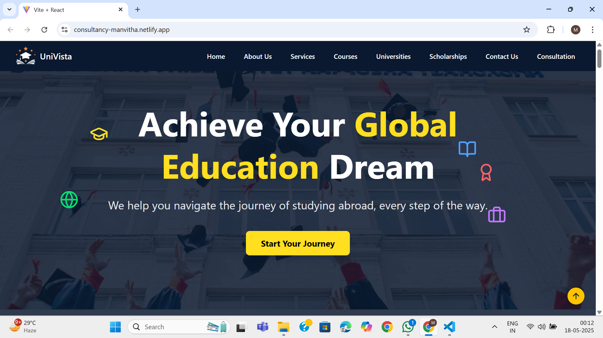
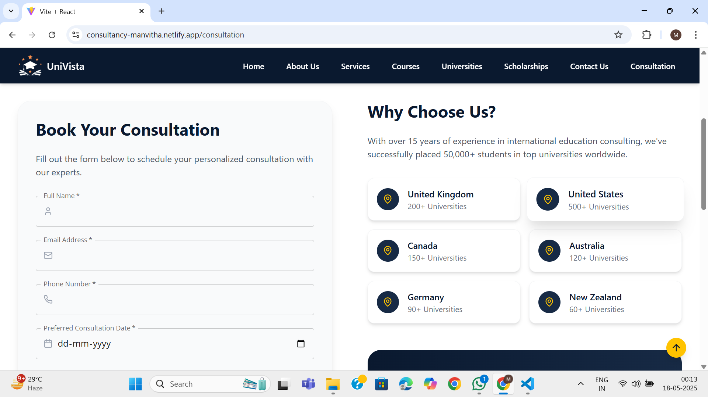
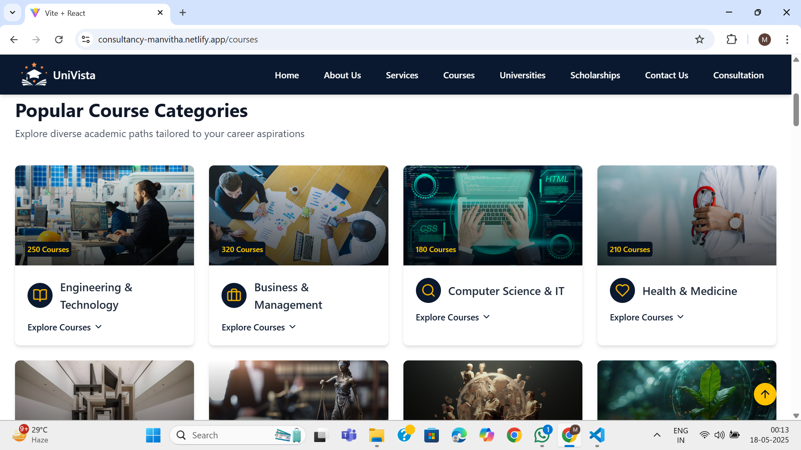

# Univista - Overseas Education Consultancy Platform

---

## 📖 Introduction

Univista is a React-based frontend platform that guides students planning to study abroad. It offers curated information about universities, courses, scholarships, and application tips, all presented through a clean, responsive, and intuitive user interface. The platform also includes testimonials, blogs, and FAQs to help students navigate their overseas education journey smoothly.

---

## 📜 Abstract

Studying abroad can be overwhelming due to the abundance of information and complex application processes. Univista simplifies this by consolidating essential resources and guidance into a single, user-friendly React web app. It helps students explore universities, courses, scholarships, and expert tips without needing a backend, making it lightweight and fast.

---

## ✨ Features

- Interactive UI built with React  
- Detailed university profiles and course information  
- Scholarship listings and tips for application success  
- Blogs and testimonials to inspire and inform  
- FAQs section addressing common study abroad questions  
- Responsive design for desktop and mobile devices  
- Easy navigation with smooth transitions and modern look  

---

## 🖼️ Screenshots

  
  
  

---

## 🌐 Live Demo

Check out the live demo here:  
[Univista Live Demo](https://github.com/ManvithaPola/Consultancy)  

---

## 🛠️ Tech Stack

- **Frontend:** React.js  
- **Styling:** TailwindCSS
- **Routing:** React Router DOM  
- **Build Tool:** Create React App  
- **Version Control:** Git & GitHub  

---

## 🧠 Approach

1. **Planning & Design:** Mapped out key components and UI flows for an educational consultancy platform.  
2. **Component Development:** Built reusable React components for universities, courses, scholarships, blogs, FAQs, and testimonials.  
3. **Routing:** Implemented React Router for seamless navigation between pages.  
4. **Styling:** Used CSS and Bootstrap for responsive and aesthetic UI design.  
5. **Testing:** Ensured cross-browser compatibility and mobile responsiveness.  
6. **Deployment:** Hosted the app using GitHub Pages for easy access.  

---

## 📋 Cloning the Repository

```bash
git clone https://github.com/ManvithaPola/Consultancy.git
cd Consultancy
```
## 🚀 Running the Application Locally

Make sure you have Node.js installed.

Navigate to the project directory and install dependencies:

```bash
npm install
```
## Start the development server:

```bash
npm start
```

Open your browser and go to http://localhost:3000 to view the app.

---

## 🔮 Future Enhancements

- **Add State Management:** Use Redux or Context API for better state handling.

- **Dynamic Content Loading:** Integrate APIs for real-time university and scholarship data.

- **Search & Filter:** Implement search bars and filters for universities and courses.

- **User Authentication:** Allow users to save favorites and personalize their experience.

- **Multilingual Support:** Offer content in multiple languages.